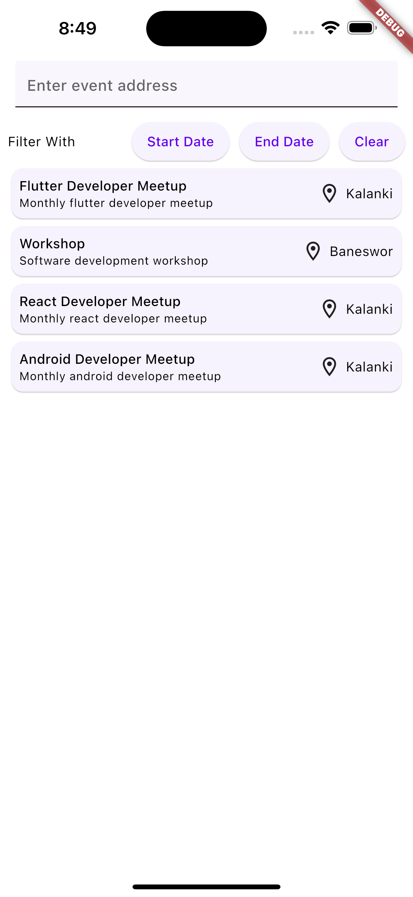
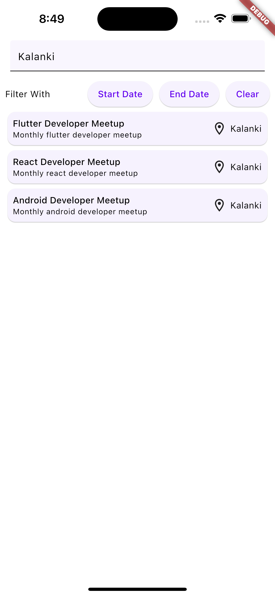
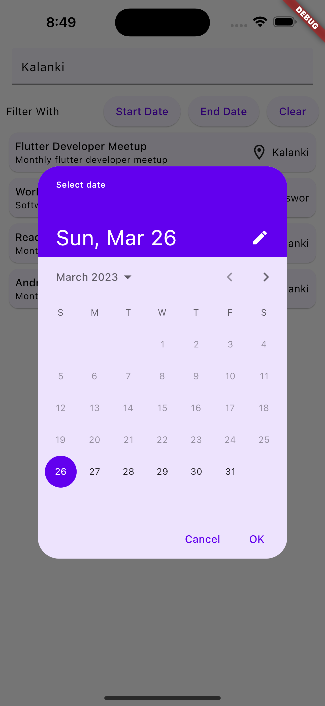
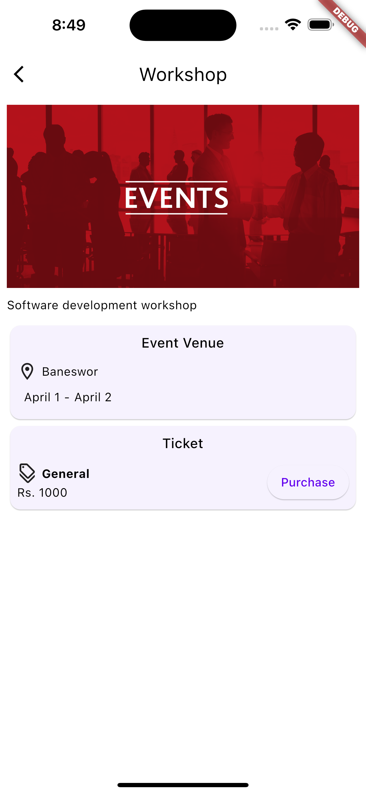

# event_management_mobile

This is a mobile application that consumes API exposed by [event_management](https://github.com/sharmashashi/event_management) system.


# Screenshots

<div class="row">
</img>
</img>
</img>
</img>

</div>

# How to use

## Step 1:

Clone this repository

```
git clone git@github.com:sharmashashi/event_management_mobile.git
```


## Step 2:

Goto the project root and get the dependencies

```
cd event_management_mobile && flutter pub get
```


## Step 3:

Open `configs.dart` inside `/lib/core/configs/` directory and make sure the base address matches with your local server address.


## Step 4:

Run the project

```
flutter run
```
